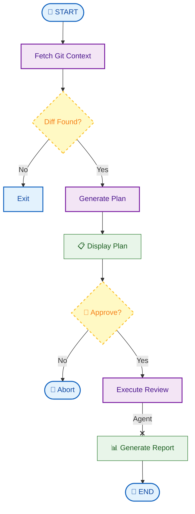

# uatiari 🎯

> **uatiari** (Nheengatu: *to guide*) — An intelligent code review agent that guides developers toward better code quality through eXtreme Programming principles.

---

## ✨ Overview

**uatiari** analyzes your git branches using AI and provides structured feedback based on XP best practices:

- 🧪 **Test-Driven Development** — Ensures critical paths have test coverage
- 🎨 **Simple Design** — Identifies unnecessary complexity and abstractions
- 🔍 **Code Smells** — Detects duplication, god classes, and deep nesting
- 🚫 **YAGNI** — Flags premature optimization and speculative code
- ⚡ **Business Logic** — Validates domain rules and edge cases

### The Philosophy

Just as a guide leads travelers through complex terrain, **uatiari** guides developers through code reviews with:

1. **Plan** → The agent analyzes your diff and proposes a review strategy
2. **Approval** → You explicitly approve before execution (human-in-the-loop)
3. **Execution** → Receives structured, actionable feedback

---

## 🚀 Quick Start

### Prerequisites

```bash
Python 3.11+  |  Git  |  Google Gemini API Key
```

### Installation

#### Standard Installation (Recommended)

Install the standalone binary (no Python required) using our installer script:

```bash
curl -fsSL https://raw.githubusercontent.com/fernandoguedes/uatiari/main/install.sh | bash
```

This will install `uatiari` to `~/.local/bin`.

#### Development Installation

```bash
# Clone and setup
git clone https://github.com/fernandoguedes/uatiari.git
cd uatiari
poetry install
```

### Configuration

`uatiari` looks for your `GOOGLE_API_KEY` in the following locations (highest priority first):

1. **Local .env**: `./.env` (Project specific overrides)
2. **Global Config**: `~/.config/uatiari/.env` (Recommended for global use)
3. **Legacy Config**: `~/.uatiari.env`
4. **Environment Variable**: `GOOGLE_API_KEY` exported in shell

**Setup Global Configuration:**

```bash
mkdir -p ~/.config/uatiari
echo "GOOGLE_API_KEY=your-key-here" > ~/.config/uatiari/.env
```

> 🔑 Get your API key at [Google AI Studio](https://aistudio.google.com/app/apikey)

### Basic Usage

```bash
# Review a feature branch
uatiari feature/user-authentication

# Compare against a different base
uatiari feature/new-api --base=develop

# Use specific skills (e.g., Laravel)
uatiari feature/payment --skill=laravel
```

### 🧠 Skills System

**uatiari** features a modular skills system that automatically detects frameworks and languages to provide specialized feedback.

**Supported Skills:**
- **Laravel**: Focuses on N+1 queries, Eloquent performance, security (SQLi, mass assignment), and database design.

You can also manually use a specific skill set using the `--skill` flag.

### Updating

Update to the latest version directly from the CLI:

```bash
uatiari update
```

---

## 📊 Example Session

```bash
$ uatiari feature/payment-validation
```

```
🎯 uatiari - XP Code Reviewer
Branch: feature/payment-validation → main

⏳ Fetching git context...
✅ Found 3 changed file(s)

⏳ Generating review plan...
```

```
╭─ 📋 Review Plan ───────────────────────────────────────────────────╮
│                                                                    │
│  ## 🔴 HIGH RISK                                                   │
│  - src/payment/processor.py (145L)                                 │
│    - Risk: Financial calculation correctness                       │
│                                                                    │
│  ## 🟡 MEDIUM RISK                                                 │
│  - src/services/email.py (34L)                                     │
│    - Risk: Notification delivery reliability                       │
│                                                                    │
│  ## XP Focus                                                       │
│  - Verify business logic in payment calculation                    │
│  - Check for Single Responsibility Principle violation             │
│  - Ensure 100% coverage on new financial logic                     │
│                                                                    │
╰────────────────────────────────────────────────────────────────────╯

Approve execution? (y/n): y
✓ Approved

⏳ Executing XP review...
```

```
╭─ ✅ Review Complete ──────────────────────────────────────────────╮
│                                                                   │
│                     REQUEST_CHANGES                               │
│  Critical business validation missing in payment implementation   │
│                                                                   │
╰───────────────────────────────────────────────────────────────────╯

╭─ 🚫 Blocking Issues ──────────────────────────────────────────────╮
│ File                   Lines   Issue                  Action      │
│ ───────────────────────────────────────────────────────────────── │
│ src/payment/processor  78-92   Business Logic: Allow  Add check:  │
│ .py                            s negative amounts     amount > 0  │
╰───────────────────────────────────────────────────────────────────╯

╭─ ⚠️  Warnings ────────────────────────────────────────────────────╮
│ File              Lines    Issue             Suggestion    Effort │
│ ───────────────────────────────────────────────────────────────── │
│ src/payment/proc  120-165  Complex Method:   Extract       20 min │
│ essor.py                   Dual responsibil  method               │
│                            ities                                  │
╰───────────────────────────────────────────────────────────────────╯

╭─ 📊 Test Coverage Analysis ───────────────────────────────────────╮
│                                                                   │
│  Production Lines: 125                                            │
│  Test Lines: 45                                                   │
│  Ratio: 0.36                                                      │
│  Verdict: MISSING                                                 │
│                                                                   │
╰───────────────────────────────────────────────────────────────────╯
```

---

## 🏗️ Architecture

### Workflow



### Tech Stack

| Component | Technology |
|-----------|------------|
| **Orchestration** | LangGraph (State Machine) |
| **AI Model** | Google Gemini 2.0 Flash |
| **Git Integration** | Native Git CLI |
| **Terminal UI** | Rich (Tables, Panels, Markdown) |
| **Distribution** | PyInstaller (Standalone Binary) |

### Project Structure

```
uatiari/
├── 📁 src/
│   └── 📁 uatiari/            # Main package
│       ├── cli.py             # Entry point
│       ├── config.py          # Configuration & Constants
│       ├── logger.py          # Rich-based Output System
│       ├── skills_manager.py  # Language/Framework Detection
│       ├── updater.py         # Self-update Mechanism
│       ├── version.py         # Version Control
│       ├── 📁 graph/          # LangGraph Implementation
│       │   ├── state.py       # TypedDict definitions
│       │   ├── nodes.py       # Workflow Steps
│       │   └── workflow.py    # Graph Compilation
│       ├── 📁 tools/          # Helpers
│       │   └── git_tools.py   # Diff & File Operations
│       └── 📁 prompts/        # System Prompts
│           └── xp_reviewer.py # XP Methodology Rules
├── 📁 tests/                  # Pytest Suite
└── 📜 install.sh              # Installation Script
```

---

## 📖 Output Format

### Blocking Issues

Critical problems that **must** be fixed:

- ❌ Business logic violations
- 🔒 Security vulnerabilities  
- 💾 Data corruption risks

### Warnings

Important issues that **should** be addressed:

- ⚠️ Code complexity (god methods, deep nesting)
- 🧪 Missing tests for critical paths
- 📋 Code duplication

### Suggestions

Optional improvements:

- ✨ Naming clarity
- 🔧 Small refactorings (<30min)
- 🚫 YAGNI violations

### Verdicts

| Verdict | Meaning |
|---------|---------|
| ✅ **APPROVE** | Ready to merge |
| 🔄 **REQUEST_CHANGES** | Needs fixes before merge |
| 🛑 **BLOCK** | Critical issues present |

---

## 🛠️ Development

### Run Tests

```bash
poetry run pytest -v
```

### Code Quality

```bash
# Format code
poetry run black src/ tests/

# Lint
poetry run ruff check src/ tests/
```

### Customize XP Rules

Edit `src/prompts/xp_reviewer.py` to modify:
- Review priorities
- Blocking conditions
- XP principles enforced

---

## 🐛 Troubleshooting

<details>
<summary><strong>Common Issues</strong></summary>

| Problem | Solution |
|---------|----------|
| `Not in a git repository` | Run from within a git repo directory |
| `Branch does not exist` | Verify with `git branch -a` |
| `GOOGLE_API_KEY not found` | Add key to `.env` file |
| `No differences found` | Branches are identical |
| Review seems incomplete | Large diffs may be truncated |

</details>

---

## 🎓 XP Principles

### What We Enforce

| Principle | Implementation | Action |
|-----------|---------------|--------|
| **Test-Driven Development** | Production code needs tests | 🛑 BLOCK if missing |
| **Simple Design** | No god classes, deep nesting | ⚠️ WARN if complex |
| **Refactoring** | Small, safe improvements | 💡 SUGGEST steps |
| **YAGNI** | No premature optimization | 🚫 FLAG violations |

---

## 🤝 Contributing

This project follows XP values:

- ✅ **Tests first** — TDD approach
- 🎯 **Simplicity** — YAGNI, Simple Design
- 🔄 **Continuous refactoring** — Small improvements
- 📦 **Small commits** — Focused changes

**PR Guidelines:**
1. Include tests demonstrating the change
2. Keep implementation simple and focused
3. Write clear commit messages (explain WHY)

---

## 📄 License

MIT License — see [LICENSE](LICENSE) file for details

---

## 🙏 Acknowledgments

Built with:
- [LangGraph](https://github.com/langchain-ai/langgraph) — State machine orchestration
- [Google Gemini](https://ai.google.dev/) — AI-powered code analysis
- [Rich](https://github.com/Textualize/rich) — Beautiful terminal output

---

<div align="center">

**"A guide does not carry you — they show you the path."**

*Made with ❤️ by developers, for developers*

</div>
