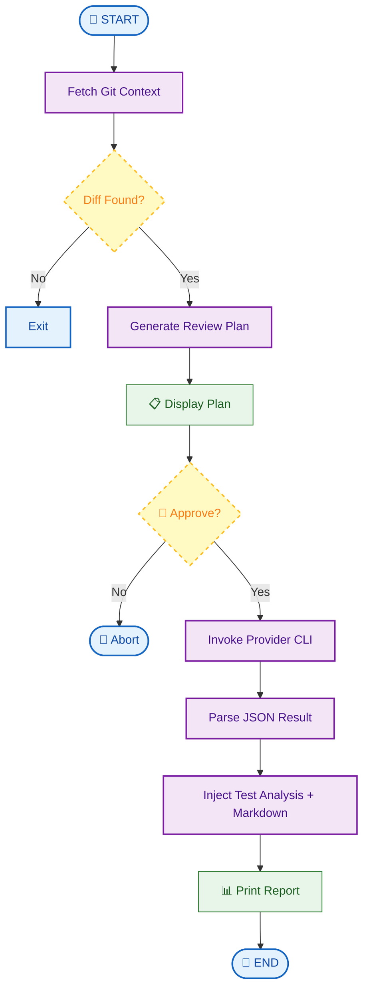

# uatiari 🎯

[](https://github.com/fernandoguedes/uatiari/actions/workflows/ci.yml)
[](https://codecov.io/gh/fernandoguedes/uatiari)


> **uatiari** (Nheengatu: *to guide*) — An intelligent code review agent that guides developers toward better code quality through eXtreme Programming principles.

---

## ✨ Overview

**uatiari** analyzes your git branches using local AI CLIs and provides structured feedback based on XP best practices:

- 🧪 **Test-Driven Development** — Ensures critical paths have test coverage
- 🎨 **Simple Design** — Identifies unnecessary complexity and abstractions
- 🔍 **Code Smells** — Detects duplication, coupling, and deep nesting
- 🚫 **YAGNI** — Flags premature optimization and speculative code
- ⚡ **Business Logic** — Validates domain rules and edge cases

Unlike the previous API-based implementation, **uatiari** now runs as a native Go binary and delegates model execution to installed CLI tools.

### The Philosophy

Just as a guide leads travelers through complex terrain, **uatiari** guides developers through code reviews with:

1. **Plan** → The CLI analyzes your diff and proposes a review strategy
2. **Approval** → You explicitly approve before invoking the selected provider
3. **Execution** → The provider returns structured JSON with Markdown-ready feedback

---

## 🚀 Quick Start

### Prerequisites

```bash
Go 1.26+  |  Git  |  At least one supported AI CLI
```

Supported providers:

- **Kimi**: `kimi`
- **Gemini**: `gemini`
- **Claude**: `claude`
- **Antigravity**: `agy`
- **Codex**: `codex`

> uatiari does **not** call model APIs directly. Each provider is invoked through its local CLI.

### Installation

#### Standard Installation (Recommended)

Install the standalone binary using the installer script:

```bash
curl -fsSL https://raw.githubusercontent.com/fernandoguedes/uatiari/main/install.sh | bash
```

This will install `uatiari` to `~/.local/bin`.

#### Development Installation

```bash
# Clone and setup
git clone https://github.com/fernandoguedes/uatiari.git
cd uatiari

# Run tests
go test ./...

# Build locally
go build -o uatiari ./cmd/uatiari
```

### Configuration

`uatiari` resolves the provider in this priority order:

1. **CLI flag**: `--provider=codex`
2. **Global Config**: `~/.config/uatiari/config.toml`
3. **Environment Variable**: `UATIARI_PROVIDER`
4. **Default**: `gemini`

**Setup Global Configuration:**

```bash
uatiari config set provider kimi
```

**Check provider availability:**

```bash
uatiari providers doctor
```

Optional environment defaults:

```bash
export UATIARI_PROVIDER=codex
export UATIARI_FORMAT=json
export UATIARI_LANG=pt_BR
```

### Basic Usage

```bash
# Review a feature branch
uatiari feature/user-authentication

# Compare against a different base
uatiari feature/new-api --base=develop

# Use a specific provider
uatiari feature/payment --provider=codex

# Use specific skills (e.g., Laravel)
uatiari feature/payment --skill=laravel

# Print Markdown instead of JSON
uatiari feature/payment --format=markdown
```

### 🧠 Skills System

**uatiari** features a modular skills system that automatically detects frameworks and languages to provide specialized feedback.

**Supported Skills:**

- **Laravel**: Focuses on N+1 queries, Eloquent performance, security (SQLi, mass assignment), and database design.

You can also manually use a specific skill set using the `--skill` flag.

### Updating

Check the latest GitHub release directly from the CLI:

```bash
uatiari update
```

---

## 📊 Example Session

```bash
$ uatiari feature/payment-validation --provider=codex
```

```
Fetching git context for feature/payment-validation -> main...
Found 3 changed file(s). Provider: codex

Review plan:
1. Files to review:
   - src/payment/processor.go (145 added, 12 deleted)
   - src/services/email.go (34 added, 3 deleted)

2. XP aspects to check:
   - Business correctness, security, and data integrity risks
   - TDD coverage for changed critical paths
   - Simple Design, duplication, coupling, and YAGNI

3. Estimated review time: 5-15 minutes

Approve execution? (y/n): y
```

Default output is JSON:

```json
{
  "blocking_issues": [
    {
      "file": "src/payment/processor.go",
      "lines": "78-92",
      "category": "BUSINESS_LOGIC",
      "issue": "Payment amount is not validated and allows negative values",
      "action": "Add validation: amount > 0",
      "why_blocking": "Risk of invalid or fraudulent transactions"
    }
  ],
  "warnings": [
    {
      "file": "src/payment/processor.go",
      "lines": "120-165",
      "category": "COMPLEXITY",
      "issue": "Method handles validation, calculation, and persistence",
      "suggestion": "Extract calculation to a separate testable function",
      "effort": "20min",
      "xp_principle": "Simple Design"
    }
  ],
  "test_analysis": {
    "production_lines": 125,
    "test_lines": 45,
    "ratio": 0.36,
    "verdict": "ACCEPTABLE"
  },
  "overall": {
    "verdict": "REQUEST_CHANGES",
    "reason": "Critical business validation is missing",
    "confidence": "HIGH"
  },
  "summary_markdown": "## Revisão XP\n\n**Veredito:** REQUEST_CHANGES\n\nCritical business validation is missing",
  "comments": {
    "blocking": [
      "### Bloqueio: Payment amount is not validated and allows negative values\n\n**Arquivo:** `src/payment/processor.go:78-92`\n\n**Ação necessária:** Add validation: amount > 0\n\nRisk of invalid or fraudulent transactions"
    ]
  }
}
```

---

## 🏗️ Architecture

### Workflow


```mermaid
graph TD
    %% Output Styling
    classDef startend fill:#e3f2fd,stroke:#1565c0,stroke-width:2px,color:#0d47a1;
    classDef process fill:#f3e5f5,stroke:#7b1fa2,stroke-width:2px,color:#4a148c;
    classDef decision fill:#fff9c4,stroke:#fbc02d,stroke-width:2px,stroke-dasharray: 5 5,color:#f57f17;
    classDef artifact fill:#e8f5e9,stroke:#2e7d32,stroke-width:1px,color:#1b5e20;

    Start([🚀 START]):::startend --> Init[Fetch Git Context]:::process
    Init --> Diff{Diff Found?}:::decision

    Diff -->|No| NoDiff[Exit]:::startend
    Diff -->|Yes| Plan[Generate Review Plan]:::process

    Plan --> ShowPlan[📋 Display Plan]:::artifact
    ShowPlan --> Approval{👤 Approve?}:::decision

    Approval -->|No| Abort([🛑 Abort]):::startend
    Approval -->|Yes| Exec[Invoke Provider CLI]:::process

    Exec --> Parse[Parse JSON Result]:::process
    Parse --> Enrich[Inject Test Analysis + Markdown]:::process
    Enrich --> Report[📊 Print Report]:::artifact
    Report --> End([🏁 END]):::startend
```

### Tech Stack

| Component | Technology |
|-----------|------------|
| **Runtime** | Go native binary |
| **AI Execution** | Local provider CLIs (`kimi`, `gemini`, `claude`, `agy`, `codex`) |
| **Git Integration** | Native Git CLI |
| **Output Contract** | Structured JSON with Markdown-ready fields |
| **Distribution** | Cross-compiled Go release archives |

### Project Structure

```text
uatiari/
├── cmd/
│   └── uatiari/
│       └── main.go                 # CLI entry point
├── internal/
│   ├── app/                        # Argument parsing and command orchestration
│   ├── config/                     # Config file, env vars, defaults
│   ├── git/                        # Git CLI wrapper
│   ├── provider/                   # Provider interface and CLI adapters
│   │   └── clirunner/              # Safe os/exec runner
│   ├── report/                     # JSON schema, parser, renderers
│   ├── review/                     # XP review workflow and prompts
│   ├── skills/                     # Framework-specific review skills
│   └── version/                    # Version metadata
├── scripts/
│   └── package.sh                  # Local release package builder
└── install.sh                      # Installer script
```

---

## 📖 Output Format

### Blocking Issues

Critical problems that **must** be fixed:

- ❌ Business logic violations
- 🔒 Security vulnerabilities
- 💾 Data corruption risks

### Warnings

Important issues that **should** be addressed:

- ⚠️ Complex or coupled design
- 🧪 Weak test coverage on critical paths
- 🔁 Duplication or poor separation of responsibilities

### Suggestions

Small improvements with clear ROI:

- 💡 Better names
- 🧹 Small refactors
- 📌 More explicit domain language

### Markdown Comments

The default `json` output includes Markdown-ready fields:

- `summary_markdown`
- `comments.blocking[]`
- `comments.warnings[]`
- `comments.suggestions[]`

This keeps automation-friendly JSON while still making the output easy to copy into PR comments.

Supported render formats:

```bash
uatiari feature/auth --format=json
uatiari feature/auth --format=markdown
uatiari feature/auth --format=pretty
```

Supported languages:

```bash
uatiari feature/auth --lang=pt_BR
uatiari feature/auth --lang=en_US
```

---

## 📦 Release Assets

Release archives keep the existing installer contract:

- `uatiari-linux-x64.tar.gz`
- `uatiari-macos-x64.tar.gz`
- `uatiari-macos-arm64.tar.gz`

Each archive contains a `uatiari/` directory with the native binary.

---

## 🛠️ Development

Run the full local verification:

```bash
go test ./...
go vet ./...
go test -race ./...
scripts/package.sh
```

The CI pipeline runs the same Go checks and no longer depends on Python, Poetry, Ruff, Black, Pytest, or PyInstaller.
